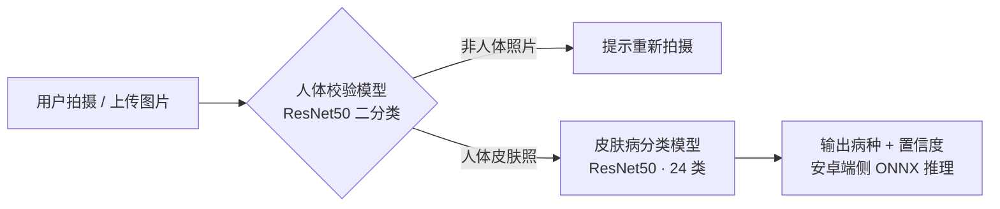
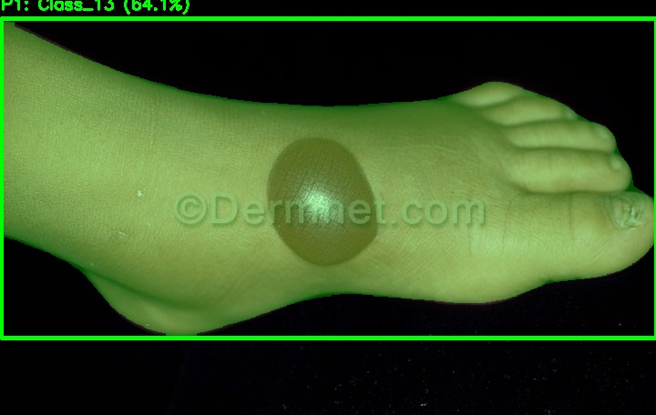

# 智慧皮肤病检测 APP —— AI 模型训练与端侧交付

> 基于 ResNet50 迁移学习的 24 类皮肤病识别系统，模型经 ONNX 导出后在安卓 APP 端侧推理。
> A 24-class skin disease recognition system (ResNet50 transfer learning, on-device inference via ONNX).

「互联网+」大赛参赛项目（2024.04 - 2024.11）。本人负责 **AI 全流程**：数据收集与清洗、标签标注、模型训练与调优、ONNX 转换与安卓端交付。

## 系统架构

APP 端采用**两级推理设计**：先由人体校验模型过滤非皮肤照片，再由分类模型输出病种与置信度，全部在手机端离线完成。



2026.01 追加了一版**多人场景增强流水线**（[`yolo_pipeline/`](yolo_pipeline/)）：YOLO11-seg 实例分割出画面中的每个人体，掩码外区域置白后裁剪皮肤区域，逐人送入分类模型并可视化结果：



*示例图片来源：Dermnet 公开皮肤病图谱，仅作演示。*

## 核心结果

| 项目 | 结果 |
| --- | --- |
| 数据规模 | 约 1.9 万张皮肤图像，24 类（训练 / 测试分集） |
| 骨干网络 | ResNet50（ImageNet 预训练 + 迁移学习） |
| 测试集准确率 | ≈ 78%（24 类） |
| 交付形式 | PyTorch → ONNX，安卓 APP 端侧离线推理 |

<details>
<summary><b>24 个病种类别</b></summary>

| # | 类别 | # | 类别 |
| --- | --- | --- | --- |
| 0 | 光化性角化病基底细胞癌及恶性病变 | 12 | 疣及软疣 |
| 1 | 光病及色素沉着障碍 | 13 | 疥疮及莱姆病或昆虫侵扰和叮咬 |
| 2 | 全身性疾病 | 14 | 疱疹HPV或其他性病 |
| 3 | 大疱性疾病 | 15 | 癣及念珠菌病或真菌感染 |
| 4 | 指甲真菌疾病 | 16 | 皮疹及药物爆发 |
| 5 | 正常皮肤 | 17 | 脂溢性角化病或良性肿瘤 |
| 6 | 毒藤照片或接触性皮炎 | 18 | 脱发或其他头发疾病 |
| 7 | 湿疹 | 19 | 荨麻疹 |
| 8 | 牛皮癣或扁平苔藓 | 20 | 蜂窝织炎脓疱病或细菌感染 |
| 9 | 特应性皮炎 | 21 | 血管炎 |
| 10 | 狼疮 | 22 | 血管肿瘤 |
| 11 | 玫瑰痤疮 | 23 | 黑色素瘤皮肤癌痣或皮肤痣 |

</details>

## 目录结构

```text
skin-disease-detection-app/
├── src/
│   ├── classes.py                 # 24 类类别表（与数据集目录顺序一致）
│   ├── models.py                  # 模型构建（与交付权重 / ONNX 结构一致）
│   ├── train_skin_classifier.py   # 第一阶段：24 分类模型全量训练
│   ├── train_finetune.py          # 第二阶段：低学习率续训微调
│   ├── train_body_verify.py       # 人体校验模型训练
│   ├── test_body_verify.py        # 人体校验模型批量测试
│   └── predict.py                 # 两级推理 + ONNX 导出
├── yolo_pipeline/
│   └── skin_analysis.py           # YOLO11-seg 人体分割 + CNN 分类增强流水线
├── docs/images/                   # 示例结果图
├── requirements.txt
└── README.md
```

## 快速开始

### 1. 环境

```bash
pip install -r requirements.txt
```

Python ≥ 3.9；训练建议使用 CUDA GPU，推理 CPU 即可。

### 2. 数据准备

数据按 torchvision `ImageFolder` 格式组织，目录名即类别名（与 [`src/classes.py`](src/classes.py) 顺序一致）：

```text
data/skin-disease/
├── train/
│   ├── 光化性角化病基底细胞癌及恶性病变/
│   ├── 湿疹/
│   └── ...（共 24 类）
└── test/
    └── ...（与 train 同 24 类）
```

### 3. 训练

```bash
cd src

# 第一阶段：全量训练（Adam + StepLR 动态学习率，按最佳测试准确率保存权重）
python train_skin_classifier.py --data-dir ../data/skin-disease --epochs 30

# 第二阶段：以 1e-6 低学习率续训微调
python train_finetune.py \
    --init-from checkpoints/skin_classifier_best.pth \
    --data-dir ../data/skin-disease \
    --epochs 5 --lr 1e-6

# （可选）训练人体校验模型
python train_body_verify.py --data-dir ../data/body-verify --epochs 3
```

### 4. 导出 ONNX 与推理

```bash
# 导出两个模型为 ONNX（输入 1x3x224x224，节点名 input / output）
python predict.py --export-onnx --export-dir ../exports

# 单张图片两级推理
python predict.py --image demo.jpg
```

### 5. 多人场景增强流水线（可选）

```bash
cd yolo_pipeline
# CNN 权重为训练得到的 state_dict；YOLO 权重从 ultralytics 官方下载
python skin_analysis.py --image test1.jpg \
    --cnn-weights cnn_model --yolo-weights yolo11n-seg.pt
```

结果（叠加掩码/检测框/标签的可视化图 + 逐人预测文本）保存在 `results/` 下。

## 技术要点

- **迁移学习**：ImageNet 预训练 ResNet50 上叠加新分类头 fine-tune；网络结构保持与已交付权重、安卓端 ONNX 完全一致（原 1000 类 fc 层保留 + `add_linear` 新头），保证本仓库代码可直接加载历史权重复现导出。
- **数据增强**：随机水平/垂直翻转、±15° 随机旋转、中心裁剪、颜色抖动，提升真实手机拍摄场景下的鲁棒性。
- **训练策略**：Adam + `StepLR` 动态学习率（每 7 轮 ×0.3）；逐 epoch 测试并只保留最佳测试准确率权重；再用 1e-6 低学习率二阶段微调收敛。
- **端侧交付**：固定输入 `1×3×224×224`，ONNX 输入/输出节点统一命名 `input` / `output`，方便安卓端集成；两级模型（人体校验 + 病种分类）均为独立 ONNX 文件。
- **工程实践**：数据 → 训练 → 微调 → 导出 → 推理全链路脚本化，CLI 参数化，类别表单点维护。

## 模型权重说明

模型权重单文件超过 100 MB，未纳入 Git 仓库。按「快速开始」步骤训练后，用 `predict.py --export-onnx` 即可复现 ONNX 导出流程。

## 仓库说明

本仓库由 2024 年大二时期的项目代码整理而来：移除了本地路径硬编码、统一为 CLI 参数化，训练逻辑与模型结构保持原始实现不变；`yolo_pipeline/` 为 2026 年 1 月追加的多人场景增强方案。

## 免责声明

本项目为大学竞赛 / 学习用途的科研演示。模型准确率有限，输出结果**不构成医疗诊断依据**，请勿用于实际医疗决策。
