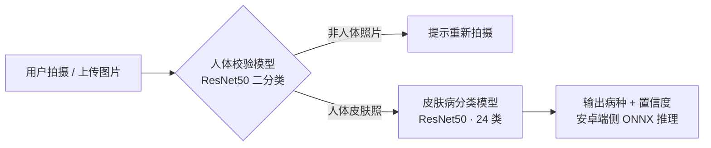

# 智慧皮肤病检测 APP —— AI 模型训练与端侧交付

> 基于 ResNet50 迁移学习的 24 类皮肤病识别系统，模型经 ONNX 导出后在安卓 APP 端侧推理。
> A 24-class skin disease recognition system (ResNet50 transfer learning, on-device inference via ONNX).

「互联网+」大赛参赛项目（2024.04 - 2024.11）。本人负责 **AI 全流程**：数据收集与清洗、标签标注、模型训练与调优、ONNX 转换与安卓端交付。

## 系统架构

APP 端采用**两级推理设计**：先由人体校验模型过滤非皮肤照片，再由分类模型输出病种与置信度，全部在手机端离线完成。



2026.01 追加了一版**多人场景增强流水线**（[`yolo_pipeline/`](yolo_pipeline/)）：YOLO11-seg 实例分割出画面中的每个人体，掩码外区域置白后裁剪皮肤区域，逐人送入分类模型并可视化结果：


*示例图片来源：Dermnet 公开皮肤病图谱，仅作演示。*

## 核心结果

| 项目 | 结果 |
| --- | --- |
| 数据规模 | 约 1.9 万张皮肤图像，24 类（训练 / 测试分集） |
| 骨干网络 | ResNet50（ImageNet 预训练 + 迁移学习） |
| 测试集准确率 | ≈ 78%（24 类，参赛交付模型） |
| 交付形式 | PyTorch → ONNX，安卓 APP 端侧离线推理 |

<details>
<summary><b>24 个病种类别</b></summary>

| # | 类别 | # | 类别 |
| --- | --- | --- | --- |
| 0 | 光化性角化病基底细胞癌及恶性病变 | 12 | 疣及软疣 |
| 1 | 光病及色素沉着障碍 | 13 | 疥疮及莱姆病或昆虫侵扰和叮咬 |
| 2 | 全身性疾病 | 14 | 疱疹HPV或其他性病 |
| 3 | 大疱性疾病 | 15 | 癣及念珠菌病或真菌感染 |
| 4 | 指甲真菌疾病 | 16 | 皮疹及药物爆发 |
| 5 | 正常皮肤 | 17 | 脂溢性角化病或良性肿瘤 |
| 6 | 毒藤照片或接触性皮炎 | 18 | 脱发或其他头发疾病 |
| 7 | 湿疹 | 19 | 荨麻疹 |
| 8 | 牛皮癣或扁平苔藓 | 20 | 蜂窝织炎脓疱病或细菌感染 |
| 9 | 特应性皮炎 | 21 | 血管炎 |
| 10 | 狼疮 | 22 | 血管肿瘤 |
| 11 | 玫瑰痤疮 | 23 | 黑色素瘤皮肤癌痣或皮肤痣 |

</details>

## 目录结构

```text
skin-disease-detection-app/
├── src/
│   ├── classes.py            # 24 类类别表（与数据集目录顺序一致）
│   ├── models.py             # 模型工厂（标准 fc 头 + 参赛旧结构兼容开关）
│   ├── datasets.py           # ImageFolder 数据集构建与增强策略
│   ├── engine.py             # 训练/评估引擎（单轮训练、评估、最佳权重保存）
│   ├── train.py              # 训练入口（全量训练 / 低学习率微调两阶段）
│   ├── train_body_verify.py  # 人体校验二分类模型训练（含验证集划分）
│   ├── predict.py            # 两级推理（人体校验 → 病种分类，单张/批量）
│   └── export.py             # ONNX 导出（安卓端约定 input/output 节点名）
├── yolo_pipeline/
│   └── skin_analysis.py      # YOLO11-seg 人体分割 + CNN 分类增强流水线
├── tests/
│   └── test_smoke.py         # 冒烟测试（模型前向、旧结构兼容、ONNX 导出）
├── docs/images/              # 示例结果图
├── requirements.txt
├── LICENSE
└── README.md
```

## 快速开始

### 1. 环境

```bash
pip install -r requirements.txt
```

Python ≥ 3.9；训练建议 CUDA GPU，推理 CPU 即可。

### 2. 数据准备

数据按 torchvision `ImageFolder` 格式组织，类别目录名与 [`src/classes.py`](src/classes.py) 顺序一致（训练时会自动校验并提示错位）：

```text
data/skin-disease/
├── train/
│   ├── 光化性角化病基底细胞癌及恶性病变/
│   ├── 湿疹/
│   └── ...（共 24 类）
└── test/
    └── ...（与 train 同 24 类）
```

人体校验模型的数据为两个目录：`human_body/`（类别 0）与 `not_human_body/`（类别 1）。

### 3. 训练

```bash
# 第一阶段：全量训练（Adam + StepLR 动态学习率，按最佳验证准确率保存权重）
python -m src.train --data-dir data/skin-disease --epochs 30

# 第二阶段：加载第一阶段最佳权重，低学习率微调收敛
python -m src.train --data-dir data/skin-disease \
    --init-from checkpoints/skin_classifier_best.pth \
    --epochs 5 --lr 1e-6 --step-size 2 \
    --save-name skin_classifier_finetuned_best.pth

# 人体校验模型（自动从数据中划出 10% 做验证）
python -m src.train_body_verify --data-dir data/body-verify --epochs 3
```

### 4. 导出 ONNX 与推理

```bash
# 导出两个模型为 ONNX（输入 1x3x224x224，节点名 input / output，交付安卓端）
python -m src.export --export-dir exports

# 两级推理：单张或目录批量
python -m src.predict --image demo.jpg
python -m src.predict --image-dir imgs/ --body-threshold 0.5
```

### 5. 多人场景增强流水线（可选）

```bash
# YOLO 权重从 ultralytics 官方下载 yolo11n-seg.pt；CNN 权重为本仓库训练产物
python -m yolo_pipeline.skin_analysis --image test1.jpg \
    --cnn-weights checkpoints/skin_classifier_best.pth --yolo-weights yolo11n-seg.pt

# 加载参赛时期的旧结构权重（如当年的 cnn_model）时加 --legacy-head
python -m yolo_pipeline.skin_analysis --image test1.jpg \
    --cnn-weights cnn_model --legacy-head
```

结果（叠加掩码 / 检测框 / 标签的可视化图 + 逐人预测文本报告）保存在 `results/` 下。

### 6. 测试

```bash
python -m pytest tests -q     # 或 python -m tests.test_smoke
```

覆盖模型前向形状、参赛旧结构兼容性与 ONNX 导出链路，不依赖真实权重与数据。

## 技术要点

- **迁移学习**：ImageNet 预训练 ResNet50，标准做法替换 fc 分类头（2048 → num_classes）fine-tune；保留 `legacy_head` 开关兼容加载参赛时期的旧结构权重。
- **数据增强**：随机翻转 / ±15° 旋转 / 颜色抖动，针对「手机拍摄、光照多变」的真实场景设计；验证与测试只做标准预处理，保证评估口径一致。
- **训练策略**：Adam + `StepLR` 动态学习率；按最佳验证准确率保存权重；低学习率二阶段微调；固定随机种子，训练流程可复现。
- **工程化**：训练循环收敛到统一引擎（`engine.py`），避免脚本间复制粘贴；数据类别顺序自动校验，防止标签错位；人体校验模型独立划分验证集，避免「用全量数据训练再自评」的泄漏问题。
- **端侧交付**：固定输入 `1×3×224×224`，ONNX 输入/输出节点统一命名 `input` / `output`，两级模型各为独立文件，方便安卓端按名集成；冒烟测试覆盖导出链路。

## 模型权重说明

模型权重单文件超过 100 MB，未纳入 Git 仓库。按「快速开始」步骤训练后，用 `python -m src.export` 即可复现 ONNX 导出流程；参赛时期的旧结构权重可用 `legacy_head=True`（或 `--legacy-head`）加载。

## 仓库说明

本仓库为 2024 年大二参赛代码的工程化重构版（2026 整理开源）。训练配方与系统设计保持参赛时不变，代码做了规范化重构：

- 分类头统一为标准 fc 替换（参赛版为「保留 1000 类 fc + 叠加新线性头」的非常规结构，已封装进 `legacy_head` 兼容开关）；
- 人体校验模型修复为标准二分类头，两级过滤在推理侧真正生效（参赛版为单输出打分头，Python 侧 argmax 恒返回人体，实际由移动端按分数阈值过滤）；
- 公共训练循环收敛到 `engine.py`，脚本只负责装配；补充随机种子、类别校验、验证集划分与冒烟测试。

表格中的准确率由参赛交付模型（原始结构）测得。

## 免责声明

本项目为大学竞赛 / 学习用途的科研演示。模型准确率有限，输出结果**不构成医疗诊断依据**，请勿用于实际医疗决策。
